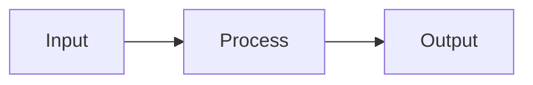

# AliceMultiverse Documentation

This directory contains the comprehensive technical documentation for AliceMultiverse.

## Building the Documentation

### Prerequisites

Install the documentation dependencies:

```bash
pip install -r requirements-docs.txt
```

### Local Development

To serve the documentation locally with live reload:

```bash
# Serve on http://localhost:8000
mkdocs serve

# Or specify a different port
mkdocs serve -a localhost:8080
```

### Building Static Site

To build the static documentation site:

```bash
# Build to site/ directory
mkdocs build

# Build with strict mode (fails on warnings)
mkdocs build --strict
```

## Documentation Structure

```
docs/
├── index.md                    # Home page
├── getting-started/           # Installation and setup
│   ├── installation.md
│   ├── quickstart.md
│   └── configuration.md
├── user-guide/               # End-user documentation
│   ├── basic-usage.md
│   ├── quality-assessment.md
│   ├── watch-mode.md
│   ├── pipeline-system.md
│   └── api-keys.md
├── architecture/             # Technical design
│   ├── system-design.md
│   ├── pipeline-architecture.md
│   ├── caching-strategy.md
│   └── design-decisions.md
├── api/                      # API reference
│   └── reference/           # Auto-generated docs
├── tutorials/               # Step-by-step guides
└── developer/              # Contributing guide
```

## Writing Documentation

### Style Guide

1. **Use clear headings** - Help readers navigate
2. **Include examples** - Show, don't just tell
3. **Add diagrams** - Visualize complex concepts
4. **Cross-reference** - Link related topics

### Markdown Extensions

The documentation supports:

- **Admonitions** for notes and warnings
- **Code blocks** with syntax highlighting
- **Mermaid diagrams** for flowcharts
- **Tables** with enhanced formatting
- **Tabs** for alternative content

### Example: Admonition

```markdown
!!! note "Important"
    This is an important note for users.

!!! warning "Caution"
    Be careful with this operation.

!!! tip "Pro Tip"
    Here's a helpful tip!
```

### Example: Mermaid Diagram

```markdown

```

### Example: Code Tabs

```markdown
=== "Python"
    ```python
    from alicemultiverse import MediaOrganizer
    organizer = MediaOrganizer(config)
    ```

=== "CLI"
    ```bash
    alice
    ```
```

## Deploying Documentation

### GitHub Pages

1. Build the documentation:
   ```bash
   mkdocs build
   ```

2. Deploy to GitHub Pages:
   ```bash
   mkdocs gh-deploy
   ```

### Custom Hosting

The `site/` directory contains static HTML that can be hosted anywhere:

- Netlify
- Vercel
- AWS S3
- nginx/Apache

## API Documentation

API documentation is auto-generated from docstrings using mkdocstrings.

To document a module:

```python
"""Module description.

This module handles...

Example:
    >>> from alicemultiverse import MediaOrganizer
    >>> organizer = MediaOrganizer(config)
"""
```

To document a class:

```python
class MediaOrganizer:
    """Organizes AI-generated media files.
    
    Args:
        config: Configuration object
        
    Attributes:
        source_dir: Source directory path
        output_dir: Output directory path
        
    Example:
        >>> organizer = MediaOrganizer(config)
        >>> organizer.organize()
    """
```

## Contributing to Docs

1. **Fork and clone** the repository
2. **Create a branch** for your changes
3. **Edit documentation** in Markdown
4. **Preview locally** with `mkdocs serve`
5. **Submit PR** with your changes

### Documentation TODO

- [ ] Add more tutorials
- [ ] Create video guides
- [ ] Add architecture diagrams
- [ ] Expand API examples
- [ ] Add troubleshooting section
- [ ] Create FAQ page

## Resources

- [MkDocs Documentation](https://www.mkdocs.org/)
- [Material for MkDocs](https://squidfunk.github.io/mkdocs-material/)
- [Mermaid Diagrams](https://mermaid-js.github.io/mermaid/)
- [CommonMark Spec](https://commonmark.org/)

---

## Documentation Overview

This comprehensive documentation system includes:

### Key Features

- **Complete User Documentation** - From installation to advanced pipelines
- **Technical Architecture** - System design with detailed reasoning
- **Design Decisions** - Why we built it this way
- **API Reference Structure** - Ready for auto-generation
- **Developer Guides** - Contributing and development

### Documentation Principles

1. **Show, Don't Just Tell** - Extensive examples and diagrams
2. **Progressive Complexity** - Start simple, add depth
3. **Real-World Focus** - Practical workflows and use cases
4. **Technical Accuracy** - Precise implementation details
5. **User Empathy** - Written for humans, not machines

### Benefits

1. **Common Understanding** - Clear specification of system behavior
2. **Onboarding** - New developers can understand quickly
3. **Design Rationale** - Decisions documented with reasoning
4. **Maintainability** - Future changes made with context
5. **User Experience** - Clear guides for all user levels