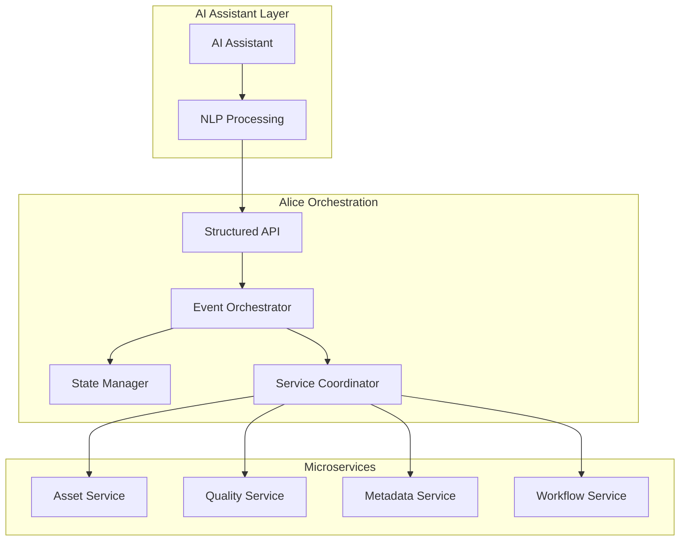

# Alice Orchestration Architecture

## Overview

Alice is the orchestration layer that sits between AI assistants and technical services. It provides structured APIs for creative workflows, manages service coordination, and handles all technical complexity through event-driven microservices.

## Design Philosophy

### Alice as API Gateway

AI assistants communicate with Alice using **structured requests**. Natural language processing happens at the AI layer, not in Alice:

```python
# AI translates: "Find that cyberpunk thing from last month"
# Into structured API call:
alice.search_assets({
    "filters": {
        "media_type": "image",
        "tag_values": {
            "style": "cyberpunk"
        },
        "date_range": {
            "start": "2024-04-01",
            "end": "2024-04-30"
        }
    }
})
```

### Core Responsibilities

Alice handles:
- **Service Orchestration**: Coordinating between microservices
- **Event Management**: Publishing and routing events
- **State Management**: Tracking workflow state
- **Transaction Coordination**: Ensuring consistency across services
- **Error Recovery**: Handling failures gracefully
- **Resource Management**: Pooling connections, managing quotas

Alice does NOT handle:
- Natural language processing
- Creative interpretation
- Semantic understanding
- AI/ML tasks

## Architecture



## API Design Principles

### 1. Structured Requests Only

```python
# ❌ Bad: Natural language
alice.process("enhance that image and make it brighter")

# ✅ Good: Structured command
alice.execute_workflow({
    "workflow": "image_enhancement",
    "asset_id": "abc123",
    "operations": [
        {"type": "enhance", "method": "ai"},
        {"type": "adjust", "brightness": 1.2}
    ]
})
```

### 2. Explicit Parameters

```python
# ❌ Bad: Ambiguous
alice.organize("last week's images")

# ✅ Good: Explicit
alice.organize_assets({
    "filters": {
        "date_range": {
            "start": "2024-05-19",
            "end": "2024-05-26"
        },
        "media_type": "image"
    },
    "organization": {
        "group_by": ["date", "style"],
        "destination": "weekly-review"
    }
})
```

### 3. Event-Driven Workflows

```python
# Start a workflow
response = alice.start_workflow({
    "type": "batch_quality_assessment",
    "filters": {
        "tag_values": {"status": "unprocessed"},
        "media_type": "image"
    },
    "parameters": {
        "pipeline": "premium",
        "max_cost": 10.00
    }
})

# Workflow publishes events:
# - workflow.started
# - asset.processing_started (per asset)
# - quality.assessed (per asset)
# - workflow.completed
```

## Service Coordination

Alice coordinates between services using events:

```python
class AliceOrchestrator:
    async def process_creative_request(self, request: dict):
        # 1. Validate structured request
        validated = self.validate_request(request)
        
        # 2. Start workflow
        workflow_id = await self.start_workflow(validated)
        
        # 3. Coordinate services
        if request["type"] == "asset_discovery":
            # Publish event for asset service
            await self.publish_event(AssetDiscoveryRequestedEvent(
                workflow_id=workflow_id,
                filters=validated["filters"]
            ))
            
        elif request["type"] == "quality_enhancement":
            # Coordinate multiple services
            assets = await self.asset_service.find(validated["filters"])
            for asset in assets:
                await self.publish_event(QualityAssessmentRequestedEvent(
                    workflow_id=workflow_id,
                    asset_id=asset.id
                ))
        
        # 4. Return trackable response
        return {
            "workflow_id": workflow_id,
            "status": "processing",
            "estimated_duration": self.estimate_duration(validated)
        }
```

## State Management

Alice maintains workflow state without storing creative interpretation:

```python
workflow_state = {
    "workflow_id": "wf-123",
    "type": "batch_enhancement",
    "status": "processing",
    "progress": {
        "total": 100,
        "completed": 45,
        "failed": 2
    },
    "parameters": {
        "quality_threshold": 4,
        "enhancement_level": "high"
    },
    "created_by": "assistant-456",
    "created_at": "2024-05-26T10:00:00Z"
}
```

## Error Handling

Alice provides structured error responses:

```python
{
    "error": {
        "code": "INSUFFICIENT_QUOTA",
        "message": "Monthly API quota exceeded",
        "details": {
            "service": "quality-analyzer",
            "quota_used": 1000,
            "quota_limit": 1000,
            "resets_at": "2024-06-01T00:00:00Z"
        },
        "suggestions": [
            "wait_until_reset",
            "upgrade_plan",
            "use_basic_pipeline"
        ]
    }
}
```

## Integration Points

### Input: Structured API
- RESTful endpoints
- GraphQL queries
- WebSocket for real-time updates
- gRPC for high-performance needs

### Output: Events and Responses
- Event streams for async operations
- Structured JSON responses
- Progress updates via WebSocket
- Batch result notifications

## Future Enhancements

1. **Service Mesh Integration**: Adopt Istio/Linkerd for better service management
2. **Workflow Engine**: Integrate Temporal/Cadence for complex workflows
3. **Caching Layer**: Add Redis for response caching
4. **Rate Limiting**: Implement per-service quotas
5. **Circuit Breakers**: Add resilience patterns

## Summary

Alice is a pure orchestration layer that:
- Accepts structured requests from AI assistants
- Coordinates between microservices via events
- Manages workflow state and transactions
- Returns structured responses

Alice explicitly does NOT:
- Process natural language
- Interpret creative concepts
- Perform AI/ML tasks
- Make creative decisions

This clean separation ensures Alice remains maintainable, testable, and scalable while AI assistants handle all creative complexity.