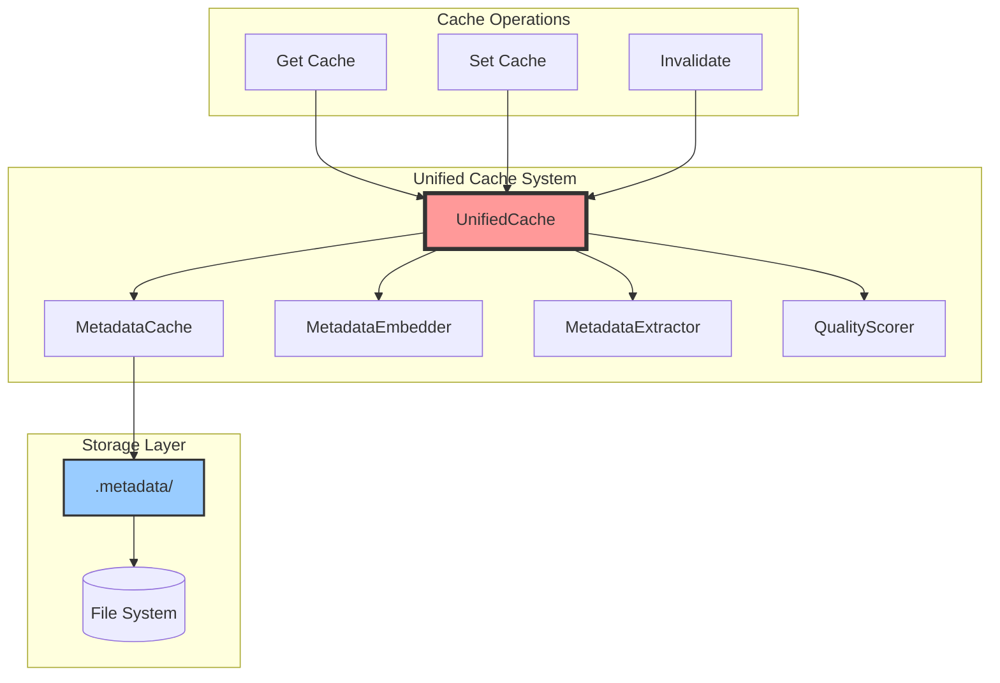
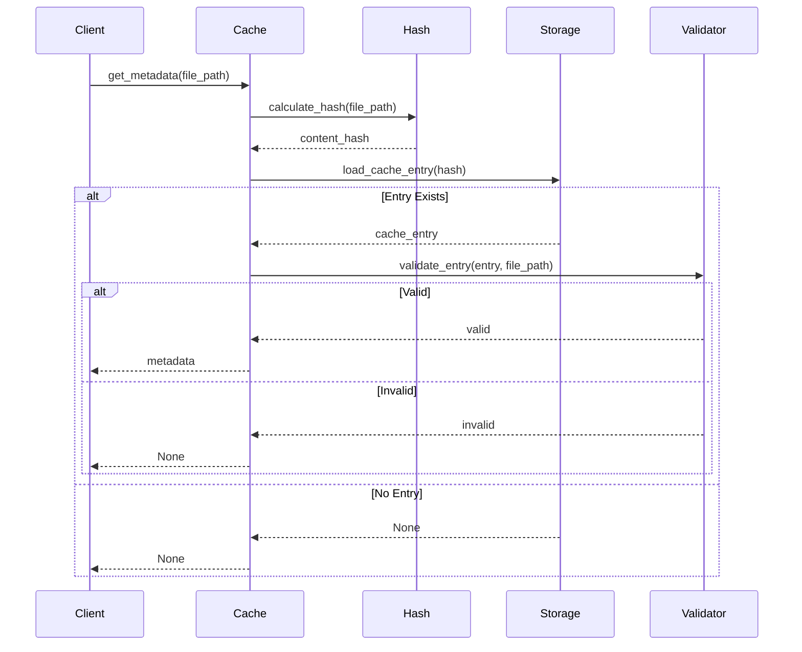

# Caching Strategy

## Overview

AliceMultiverse implements a unified content-addressed caching system (UnifiedCache) that consolidates all metadata functionality and dramatically improves performance for repeated operations. This document details the caching architecture, implementation, and optimization strategies.

## Cache Architecture



## Content-Based Hashing

### Why Content-Based?

Traditional path-based caching fails when:
- Files are renamed or moved
- Same content exists in multiple locations
- Organizing from different source directories

Content-based hashing solves these issues by creating a unique identifier based solely on file content.

### Hash Implementation

```python
def get_content_hash(file_path: Path) -> str:
    """Generate SHA256 hash of file content."""
    sha256_hash = hashlib.sha256()
    
    # Process in chunks for memory efficiency
    with open(file_path, "rb") as f:
        for byte_block in iter(lambda: f.read(4096), b""):
            sha256_hash.update(byte_block)
    
    return sha256_hash.hexdigest()
```

### Performance Optimization

For large files, we implement streaming hash calculation:

```python
def get_content_hash_optimized(file_path: Path) -> str:
    """Optimized hash calculation with progress tracking."""
    sha256_hash = hashlib.sha256()
    file_size = file_path.stat().st_size
    
    with open(file_path, "rb") as f:
        with tqdm(total=file_size, unit='B', unit_scale=True) as pbar:
            while chunk := f.read(8192):  # Larger chunks for better I/O
                sha256_hash.update(chunk)
                pbar.update(len(chunk))
    
    return sha256_hash.hexdigest()
```

## Cache Storage Structure

### Directory Sharding

To prevent filesystem limitations with too many files in one directory:

```
.alicemultiverse_cache/
├── version.json          # Cache format version
├── stats.json           # Performance statistics
├── 00/                  # First two chars of hash
│   └── 00abcd...json
├── 01/
│   └── 01efgh...json
├── ab/
│   ├── abcd12...json
│   └── abef34...json
└── ff/
    └── ffaa11...json
```

### Why Sharding?

- Most filesystems slow down with >10,000 files per directory
- Two-character prefix creates 256 subdirectories
- Supports millions of cached files efficiently
- Balanced distribution with SHA256

## Cache Entry Format

### Schema

```json
{
    "version": "3.0.0",
    "metadata": {
        "file_hash": "abcdef1234567890...",
        "file_size": 2048576,
        "file_path": "inbox/project/image.jpg",
        "cached_at": "2024-03-15T10:30:00Z",
        "last_accessed": "2024-03-15T14:20:00Z",
        "access_count": 5
    },
    "analysis": {
        "media_type": "image",
        "dimensions": [1920, 1080],
        "date_taken": "2024-03-15",
        "source_type": "midjourney",
        "ai_confidence": 0.95,
        "quality": {
            "score": 25.5,
            "stars": 4,
            "method": "brisque"
        },
        "processing_time": 0.234
    },
    "extended": {
        "exif": {...},
        "custom_metadata": {...}
    }
}
```

### Version Management

```python
CACHE_VERSION = "3.0.0"

def migrate_cache_entry(entry: dict, from_version: str) -> dict:
    """Migrate cache entries to current version."""
    if from_version == "2.0.0":
        # Add new fields introduced in 3.0.0
        entry['metadata']['access_count'] = 1
        entry['analysis']['ai_confidence'] = 1.0
    
    entry['version'] = CACHE_VERSION
    return entry
```

## Cache Operations

### Cache Lookup



### Cache Validation

```python
def validate_cache_entry(self, entry: dict, file_path: Path) -> bool:
    """Validate cache entry is still valid."""
    # Check version compatibility
    if not self._is_compatible_version(entry.get('version')):
        return False
    
    # Check file size hasn't changed (quick check)
    current_size = file_path.stat().st_size
    if current_size != entry['metadata']['file_size']:
        return False
    
    # For critical operations, verify hash
    if self.strict_mode:
        current_hash = get_content_hash(file_path)
        if current_hash != entry['metadata']['file_hash']:
            return False
    
    return True
```

## Performance Metrics

### Cache Statistics

```python
class CacheStatistics:
    def __init__(self):
        self.hits = 0
        self.misses = 0
        self.evictions = 0
        self.corrupted = 0
        self.total_time_saved = 0.0
        
    @property
    def hit_rate(self) -> float:
        total = self.hits + self.misses
        return self.hits / total if total > 0 else 0.0
    
    def record_hit(self, time_saved: float):
        self.hits += 1
        self.total_time_saved += time_saved
    
    def save(self, path: Path):
        stats = {
            'hits': self.hits,
            'misses': self.misses,
            'hit_rate': self.hit_rate,
            'time_saved_seconds': self.total_time_saved,
            'last_updated': datetime.now().isoformat()
        }
        path.write_text(json.dumps(stats, indent=2))
```

### Performance Impact

Real-world performance improvements:

```
First Run (No Cache):
- 1000 images: 125 seconds
- Quality assessment: 100 seconds
- File operations: 25 seconds

Second Run (With Cache):
- 1000 images: 27 seconds
- Cache lookups: 2 seconds
- File operations: 25 seconds

Performance Gain: 78% faster
```

## Cache Maintenance

### Automatic Cleanup

```python
def cleanup_orphaned_entries(self):
    """Remove cache entries for files that no longer exist."""
    orphaned = []
    
    for cache_file in self.cache_dir.rglob("*.json"):
        try:
            entry = json.loads(cache_file.read_text())
            file_path = self.source_root / entry['metadata']['file_path']
            
            if not file_path.exists():
                orphaned.append(cache_file)
        except Exception as e:
            logger.error(f"Error reading cache file {cache_file}: {e}")
            orphaned.append(cache_file)
    
    for cache_file in orphaned:
        cache_file.unlink()
        self.stats.evictions += 1
```

### Cache Expiration

```python
def is_expired(self, entry: dict) -> bool:
    """Check if cache entry has expired."""
    if not self.enable_expiration:
        return False
        
    cached_at = datetime.fromisoformat(entry['metadata']['cached_at'])
    age = datetime.now() - cached_at
    
    # Expire entries older than 30 days
    return age.days > self.max_age_days
```

## Advanced Caching Strategies

### 1. Hierarchical Caching

For very large collections, implement multi-level caching:

```python
class HierarchicalCache:
    def __init__(self):
        self.memory_cache = {}  # LRU cache in memory
        self.disk_cache = DiskCache()  # Persistent cache
        
    def get(self, key: str) -> Optional[dict]:
        # Check memory first
        if key in self.memory_cache:
            return self.memory_cache[key]
        
        # Check disk
        value = self.disk_cache.get(key)
        if value:
            self.memory_cache[key] = value
        
        return value
```

### 2. Predictive Caching

Pre-cache likely entries based on usage patterns:

```python
def prefetch_related(self, file_path: Path):
    """Prefetch cache entries for related files."""
    directory = file_path.parent
    
    # Prefetch all images in same directory
    for related_file in directory.glob("*.jpg"):
        if not self.has_cached(related_file):
            self._background_analyze(related_file)
```

### 3. Distributed Caching

For team environments, share cache across machines:

```python
class DistributedCache:
    def __init__(self, redis_url: str):
        self.redis = redis.from_url(redis_url)
        self.local_cache = DiskCache()  # Fallback
        
    def get(self, key: str) -> Optional[dict]:
        try:
            # Try distributed cache first
            data = self.redis.get(key)
            if data:
                return json.loads(data)
        except redis.RedisError:
            # Fall back to local cache
            pass
            
        return self.local_cache.get(key)
```

## Cache Security

### Integrity Protection

```python
def save_with_integrity(self, key: str, data: dict):
    """Save cache entry with integrity check."""
    json_data = json.dumps(data, sort_keys=True)
    
    # Calculate checksum
    checksum = hashlib.md5(json_data.encode()).hexdigest()
    
    # Save with checksum
    entry = {
        'data': data,
        'checksum': checksum
    }
    
    cache_path = self._get_cache_path(key)
    cache_path.write_text(json.dumps(entry))

def load_with_integrity(self, key: str) -> Optional[dict]:
    """Load and verify cache entry integrity."""
    cache_path = self._get_cache_path(key)
    
    try:
        entry = json.loads(cache_path.read_text())
        data = entry['data']
        
        # Verify checksum
        json_data = json.dumps(data, sort_keys=True)
        checksum = hashlib.md5(json_data.encode()).hexdigest()
        
        if checksum != entry['checksum']:
            logger.warning(f"Cache integrity check failed for {key}")
            return None
            
        return data
    except Exception as e:
        logger.error(f"Failed to load cache entry {key}: {e}")
        return None
```

## Best Practices

1. **Always Version Cache Entries** - Enables smooth migrations
2. **Include Timestamps** - For debugging and expiration
3. **Handle Corruption Gracefully** - Don't crash on bad entries
4. **Monitor Hit Rates** - Identify optimization opportunities
5. **Clean Up Periodically** - Prevent unlimited growth
6. **Use Atomic Operations** - Prevent partial writes
7. **Implement Fallbacks** - Continue working if cache fails

## Future Enhancements

1. **Compression** - Reduce disk usage for large caches
2. **Encryption** - Protect sensitive metadata
3. **Cloud Sync** - Share cache across devices
4. **Smart Eviction** - LRU/LFU policies
5. **Cache Warming** - Pre-populate on startup