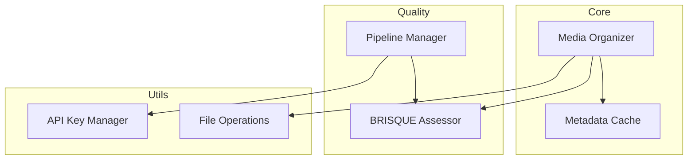

# Design Decisions

This document captures the key design decisions made during the development of AliceMultiverse, including the reasoning, alternatives considered, and trade-offs.

## 1. Content-Based Caching

### Decision
Use SHA256 hashes of file content for cache keys rather than file paths.

### Reasoning
- **Resilience**: Files can be moved/renamed without cache invalidation
- **Deduplication**: Identical files are automatically detected
- **Consistency**: Content determines cache, not location

### Alternatives Considered
1. **Path-based caching**: Simpler but breaks on file moves
2. **Modification time**: Unreliable across systems
3. **Size + name hash**: Still allows duplicates

### Trade-offs
- ✅ More robust and reliable
- ✅ Enables cross-directory deduplication
- ❌ Slightly slower initial hash computation
- ❌ Can't cache failed/corrupted files

### Implementation
```python
def get_content_hash(file_path: Path) -> str:
    """Generate SHA256 hash of file content."""
    sha256_hash = hashlib.sha256()
    with open(file_path, "rb") as f:
        for byte_block in iter(lambda: f.read(4096), b""):
            sha256_hash.update(byte_block)
    return sha256_hash.hexdigest()
```

## 2. Progressive Quality Pipeline

### Decision
Implement a multi-stage pipeline with increasingly expensive quality checks.


### Reasoning
- **Cost Optimization**: 70-90% reduction in API costs
- **Speed**: Fast local filtering before slow API calls
- **Flexibility**: Users can choose their comfort level

### Alternatives Considered
1. **All-or-nothing**: Too expensive for large collections
2. **Random sampling**: Might miss best/worst images
3. **User scoring**: Too subjective and time-consuming

### Trade-offs
- ✅ Dramatic cost savings
- ✅ Configurable pipeline stages
- ✅ Preserves all images with ratings
- ❌ More complex implementation
- ❌ Multiple points of failure

## 3. Star Rating Organization

### Decision
Organize images into star-rating folders (1-star through 5-star) based on quality scores.

### Reasoning
- **Intuitive**: Everyone understands star ratings
- **Browsable**: Easy to find best content
- **Flexible**: Users can ignore if not needed

### Alternatives Considered
1. **Score in filename**: `image_brisque_32.5.jpg`
2. **Metadata only**: Requires special viewer
3. **Best/Good/Poor folders**: Too simplistic

### Trade-offs
- ✅ Immediately understandable
- ✅ Works with any file browser
- ✅ Progressive refinement possible
- ❌ More directories to navigate
- ❌ Subjective boundaries

## 4. BRISQUE as Primary Quality Metric

### Decision
Use BRISQUE (Blind/Referenceless Image Spatial Quality Evaluator) as the primary quality metric.

### Reasoning
- **No Reference Needed**: Works on any image
- **Proven Algorithm**: Well-established in research
- **Fast**: Runs locally without GPU
- **Free**: No API costs

### Alternatives Considered
1. **NIQE**: Similar but less intuitive scores
2. **PSNR/SSIM**: Requires reference image
3. **ML Models**: Requires training data
4. **Human scoring**: Not scalable

### Trade-offs
- ✅ Works on any content
- ✅ Fast and free
- ✅ Well-understood algorithm
- ❌ Not trained on AI content specifically
- ❌ May miss AI-specific artifacts

## 5. Pattern-Based AI Detection

### Decision
Detect AI tools through filename patterns and metadata rather than image analysis.

### Reasoning
- **Accuracy**: AI tools have distinct naming conventions
- **Speed**: No image processing required
- **Extensibility**: Easy to add new patterns
- **Zero Cost**: No API or ML inference needed

### Implementation Example
```python
patterns = {
    'midjourney': [r'_[a-f0-9]{8}-[a-f0-9]{4}-', r'mj_'],
    'stable-diffusion': [r'\d{10,}', r'sd_'],
    'dalle': [r'dalle[-_]?[23]', r'openai'],
}
```

### Alternatives Considered
1. **ML Classification**: Complex and needs training
2. **Metadata only**: Not all tools write metadata
3. **User input**: Too much manual work
4. **API detection**: Expensive and slow

### Trade-offs
- ✅ Fast and accurate for known patterns
- ✅ Zero runtime cost
- ✅ Easy to maintain and extend
- ❌ Can't detect unknown tools
- ❌ Relies on consistent naming

## 6. Watch Mode with Polling

### Decision
Implement watch mode using polling rather than filesystem events.

### Reasoning
- **Portability**: Works on all platforms
- **Reliability**: No missed events
- **Simplicity**: Easier to implement and debug
- **Control**: Configurable check interval

### Alternatives Considered
1. **inotify/FSEvents**: Platform-specific
2. **watchdog library**: Additional dependency
3. **Continuous loop**: Too resource intensive

### Trade-offs
- ✅ Cross-platform compatibility
- ✅ Simple and reliable
- ✅ Works with network drives
- ❌ Slight delay in detection
- ❌ More CPU usage than events

## 7. JSON-Based Metadata Cache

### Decision
Store cache entries as individual JSON files rather than a database.

### Reasoning
- **Simplicity**: No database dependencies
- **Debugging**: Human-readable cache files
- **Portability**: Easy to backup/share
- **Atomic Operations**: No corruption risk

### File Structure
```
.alicemultiverse_cache/
├── ab/
│   └── abcdef1234...json
├── cd/
│   └── cdef5678...json
```

### Alternatives Considered
1. **SQLite**: Overkill for key-value storage
2. **Single JSON**: Lock contention issues
3. **Pickle**: Not human-readable
4. **Redis**: External dependency

### Trade-offs
- ✅ Simple and reliable
- ✅ Human-readable
- ✅ No lock contention
- ❌ More files to manage
- ❌ Slightly slower than database

## 8. Configuration with OmegaConf

### Decision
Use OmegaConf for configuration management with YAML files.

### Reasoning
- **Flexibility**: Dot notation access
- **Overrides**: CLI overrides with simple syntax
- **Validation**: Type checking and schema support
- **Standard**: Widely used in ML projects

### Alternatives Considered
1. **configparser**: Too limited
2. **JSON**: No comments, verbose
3. **TOML**: Less flexible overrides
4. **Python files**: Security concerns

### Trade-offs
- ✅ Powerful override system
- ✅ Environment variable support
- ✅ Type safety
- ❌ Additional dependency
- ❌ Learning curve

## 9. Modular Architecture

### Decision
Separate concerns into distinct modules rather than a monolithic design.



### Reasoning
- **Testability**: Each module can be tested in isolation
- **Maintainability**: Clear separation of concerns
- **Extensibility**: Easy to add new modules
- **Reusability**: Modules can be used independently

### Trade-offs
- ✅ Clean architecture
- ✅ Easy to understand
- ✅ Parallel development possible
- ❌ More files to navigate
- ❌ Some code duplication

## 10. Error Handling Strategy

### Decision
Fail gracefully on individual files but continue processing the collection.

### Reasoning
- **Robustness**: One bad file shouldn't stop everything
- **User Experience**: See partial results
- **Debugging**: Collect all errors for review

### Implementation
```python
for file in files:
    try:
        result = process_file(file)
        stats['success'] += 1
    except Exception as e:
        logger.error(f"Failed to process {file}: {e}")
        stats['errors'] += 1
        continue
```

### Trade-offs
- ✅ Robust operation
- ✅ Better user experience
- ✅ Comprehensive error reporting
- ❌ May hide systematic issues
- ❌ Requires careful error tracking

## Conclusion

These design decisions prioritize:
1. **User Experience**: Simple, intuitive, reliable
2. **Performance**: Fast, cached, cost-effective
3. **Extensibility**: Easy to add new features
4. **Maintainability**: Clean, modular, testable

The architecture balances pragmatism with flexibility, choosing proven solutions over cutting-edge complexity.