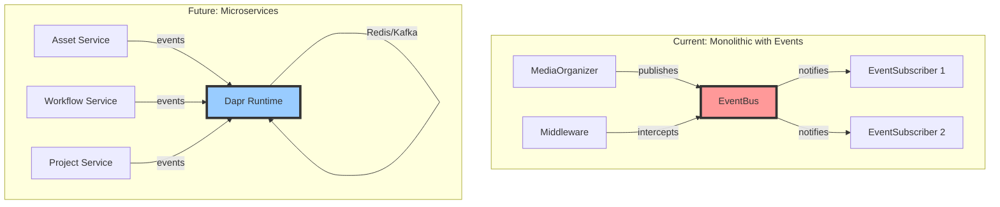

# Event-Driven Architecture

## Overview

AliceMultiverse implements an event-driven architecture that enables loose coupling between components and prepares the system for future evolution into microservices. This document describes the event system, patterns, and migration strategy.

## Why Events?

The event-driven approach provides several benefits:

1. **Loose Coupling**: Components communicate through events, not direct calls
2. **Observability**: All significant operations generate events for monitoring
3. **Evolution**: Easy to extract services without changing core logic
4. **Flexibility**: New features can subscribe to existing events
5. **Creativity Support**: Events capture the non-linear nature of creative work

## Event Architecture



## Core Events

### Asset Events

Events related to asset lifecycle:

- **asset.discovered**: New asset found in inbox
- **asset.processed**: Metadata extracted and analyzed
- **asset.organized**: Asset moved/copied to destination
- **quality.assessed**: Quality scores determined
- **metadata.updated**: Asset metadata changed

### Workflow Events

Events for creative workflow execution:

- **workflow.started**: Workflow begins execution
- **workflow.step_completed**: Individual step completes
- **workflow.completed**: Entire workflow succeeds
- **workflow.failed**: Workflow encounters error

### Creative Events

Events capturing creative decisions:

- **project.created**: New project initialized
- **style.chosen**: Style decision made
- **context.updated**: Creative context evolved
- **character.defined**: Character created/updated
- **concept.approved**: Concept ready for production

## Event Structure

All events follow a consistent structure:

```python
@dataclass
class Event:
    event_id: str          # Unique identifier
    timestamp: datetime    # When it occurred
    source: str           # Component that generated it
    version: str          # Schema version
    
    @property
    @abstractmethod
    def event_type(self) -> str:
        """Return the event type identifier."""
        pass
```

## AsyncAPI Documentation

Events are documented using AsyncAPI 3.0 specification:

```yaml
asyncapi: '3.0.0'
info:
  title: AliceMultiverse Event API
  version: '1.0.0'

channels:
  assetEvents:
    address: 'alice.assets.{eventType}'
    messages:
      assetDiscovered:
        $ref: '#/components/messages/AssetDiscovered'
```

This provides:
- Machine-readable contracts
- Auto-generated documentation
- Schema validation
- Evolution management

## Event Flow Example

Here's how events flow during asset organization:

```python
# 1. Asset discovered
discovery_event = AssetDiscoveredEvent(
    file_path="/inbox/project/image.png",
    media_type="image",
    project_name="project"
)

# 2. Asset processed
processed_event = AssetProcessedEvent(
    content_hash="abc123",
    metadata={...},
    generation_params={...}
)

# 3. Quality assessed
quality_event = QualityAssessedEvent(
    content_hash="abc123",
    star_rating=5,
    brisque_score=23.5
)

# 4. Asset organized
organized_event = AssetOrganizedEvent(
    source_path="/inbox/project/image.png",
    destination_path="/organized/2024-01-15/project/flux/5-star/project-001.png",
    quality_folder="5-star"
)
```

## Middleware System

Cross-cutting concerns are handled by middleware:

### EventLogger
Logs all events for debugging:
```python
bus.add_middleware(EventLogger(log_level=logging.DEBUG))
```

### EventMetrics
Collects statistics about event flow:
```python
metrics = EventMetrics()
bus.add_middleware(metrics)
stats = metrics.get_stats()
```

### EventPersistence
Saves events to disk for replay:
```python
bus.add_middleware(EventPersistence(Path("~/.alicemultiverse/events")))
```

### EventFilter
Filters events based on criteria:
```python
filter = EventFilter(include_types=['asset.discovered', 'asset.organized'])
bus.add_middleware(filter)
```

## Migration Strategy

### Phase 1: Add Events (Current)
- Events published alongside existing operations
- In-memory EventBus for simplicity
- Subscribers can monitor without affecting flow

### Phase 2: Extract Services
- Identify service boundaries from event patterns
- Move logic into event handlers
- Services still in same process

### Phase 3: Distribute Services
- Add Dapr for infrastructure abstraction
- Services communicate only through events
- Deploy independently when needed

### Phase 4: Scale Services
- Replace Redis with Kafka when scale demands
- No service code changes needed
- Dapr handles infrastructure complexity

## Best Practices

### Event Design

1. **Events are Facts**: Past tense, immutable
2. **Self-Contained**: Include all needed data
3. **Domain-Focused**: Business language, not technical
4. **Versioned**: Support schema evolution

### Publishing Events

```python
# Good: Domain event with business meaning
await publish_event(AssetDiscoveredEvent(
    project_name="my-video",
    source_type="comfyui",
    media_type="image"
))

# Bad: Technical event
await publish_event(FileMovedEvent(
    from="/tmp/abc",
    to="/mnt/def"
))
```

### Subscribing to Events

```python
class ProjectIndexer(EventSubscriber):
    @property
    def event_types(self):
        return ['asset.discovered', 'asset.organized']
    
    async def handle_event(self, event: Event):
        if event.event_type == 'asset.discovered':
            await self.index_asset(event.content_hash)
```

## Monitoring Events

Use the event monitor to observe system behavior:

```bash
# Basic monitoring
python scripts/event_monitor.py

# Verbose mode with full data
python scripts/event_monitor.py --verbose

# With metrics collection
python scripts/event_monitor.py --metrics

# Persist events for analysis
python scripts/event_monitor.py --persist
```

## Future: Alice as Event Orchestrator

In the target architecture, Alice becomes the intelligent orchestrator:

1. **AI Communication**: AI assistants send high-level creative commands
2. **Event Generation**: Alice translates commands into domain events
3. **Service Coordination**: Events trigger appropriate services
4. **Result Aggregation**: Alice assembles responses for AI

This maintains the principle that AI focuses on creativity while Alice handles technical complexity through events.