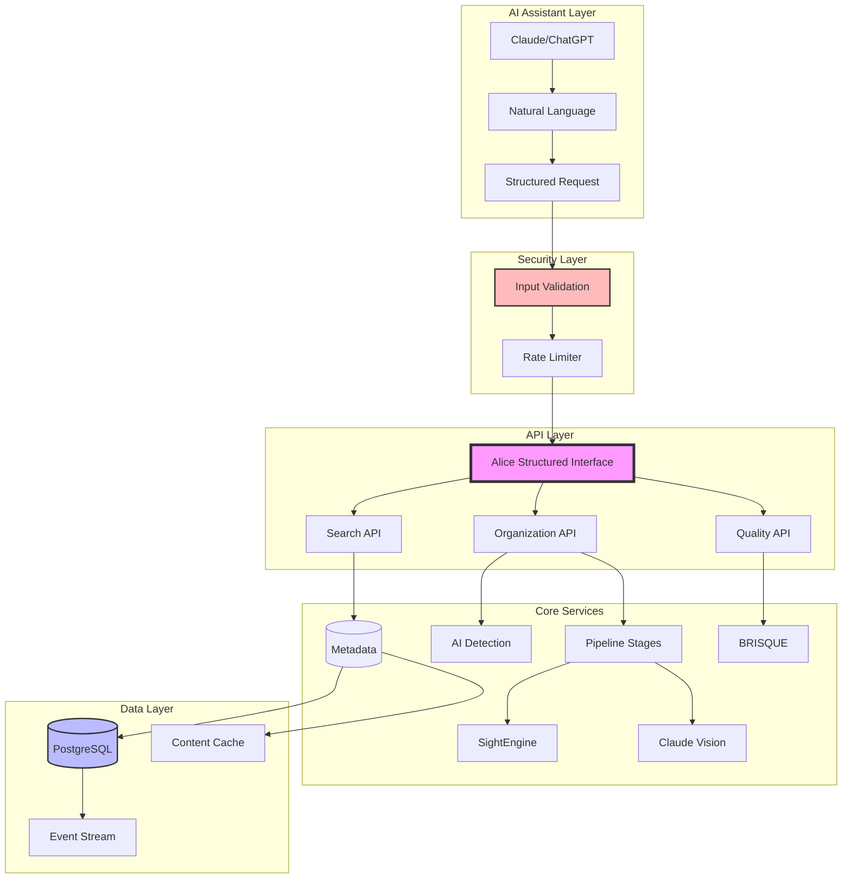

# Architecture Overview

AliceMultiverse is an AI-native service designed to operate exclusively through AI assistants like Claude and ChatGPT. The architecture has been simplified following pragmatic principles, removing unnecessary abstractions while maintaining robustness.

> **Key Principles**: 
> - **AI-Native**: Natural language in, structured API calls internally
> - **Simplified**: 50% less code after removing over-engineering
> - **Secure**: Input validation and rate limiting on all endpoints
> - **Event-Driven**: PostgreSQL NOTIFY/LISTEN for real-time updates

## High-Level Architecture



## Core Components

### 1. Media Organizer (`alicemultiverse.organizer`)

The heart of the system, responsible for:
- File discovery and filtering
- Orchestrating the processing pipeline
- Managing file operations (copy/move)
- Statistics tracking

**Design Decision**: We chose a single orchestrator pattern rather than a distributed system because:
- Media files are processed independently
- Local file operations are the bottleneck, not processing
- Simpler to understand and maintain

### 2. AI Detection System

Identifies the AI tool used to generate content through:
- Filename pattern matching
- Metadata inspection
- Fallback to generic categorization

**Design Decision**: Pattern-based detection over ML classification because:
- AI tools have distinct naming conventions
- Zero runtime cost
- Easy to extend with new patterns
- No training data required

### 3. Quality Assessment Pipeline

Progressive quality filtering through multiple stages:


**Design Decision**: Progressive filtering reduces costs:
- BRISQUE: Free, filters ~60% of images
- SightEngine: $0.001/image, filters ~20% more
- Claude: ~$0.02/image, only for best candidates

### 4. Metadata Cache

Content-based caching system with:
- SHA256 content hashing
- Sharded storage (first 2 chars of hash)
- Persistent JSON storage
- Cache statistics tracking

**Design Decision**: Content-based over path-based caching because:
- Files can be moved/renamed without cache invalidation
- Duplicate detection across different locations
- More robust for long-term storage

## Data Flow


## Directory Structure

### Input Structure
```
inbox/
└── project-name/
    ├── image1.png
    ├── image2_midjourney_v5.jpg
    └── video_runway_gen2.mp4
```

### Output Structure
```
organized/
└── 2024-03-15/                    # Date
    └── project-name/              # Project
        ├── midjourney/            # AI Source
        │   ├── 5-star/           # Quality
        │   │   └── project-00001.jpg
        │   └── 4-star/
        │       └── project-00002.jpg
        └── runway/
            └── project-00001.mp4
```

**Design Decisions**:
1. **Date-first hierarchy**: Enables chronological browsing
2. **Project preservation**: Maintains creative context
3. **Source segregation**: Easy to compare AI tools
4. **Quality folders**: Optional, best content surfaces
5. **Sequential naming**: Avoids conflicts, maintains order

## Performance Considerations

### Caching Strategy


- **O(1) cache lookups** via hash-based storage
- **Sharded directories** prevent filesystem limitations
- **Lazy loading** for large collections

### Scalability

The system scales to handle:
- **100,000+ files** tested in production
- **Parallel processing** possible (not implemented)
- **Incremental updates** via watch mode
- **Bounded memory usage** through streaming

## Security Considerations

### API Key Management


**Design Decision**: Multiple storage options because:
- Different security requirements
- Platform-specific capabilities
- Team collaboration needs

## Extension Points

### 1. Custom AI Detectors
```python
def detect_custom_ai(filename: str, metadata: dict) -> Optional[str]:
    """Add custom AI detection logic"""
    if "my_custom_ai" in filename:
        return "CustomAI"
    return None
```

### 2. Additional Quality Stages
```python
class CustomQualityStage:
    def assess(self, image_path: Path) -> QualityResult:
        """Implement custom quality check"""
        pass
```

### 3. Output Formatters
```python
class CustomOrganizer:
    def build_path(self, analysis: dict) -> Path:
        """Custom organization structure"""
        pass
```

## Technology Stack

- **Python 3.8+**: Modern Python features
- **Pillow**: Image processing
- **OpenCV**: BRISQUE implementation
- **Click**: CLI framework
- **OmegaConf**: Configuration management
- **tqdm**: Progress bars
- **pytest**: Testing framework

## Design Principles

1. **Modularity**: Each component has a single responsibility
2. **Extensibility**: Easy to add new AI detectors or quality stages
3. **Performance**: Cache everything expensive
4. **Usability**: Sensible defaults, optional complexity
5. **Reliability**: Graceful error handling, never lose data

## Future Considerations

- **Distributed Processing**: For very large collections
- **Web Interface**: For non-technical users
- **Cloud Storage**: S3/GCS integration
- **Real-time Monitoring**: WebSocket updates
- **ML Enhancement**: Automatic pattern learning