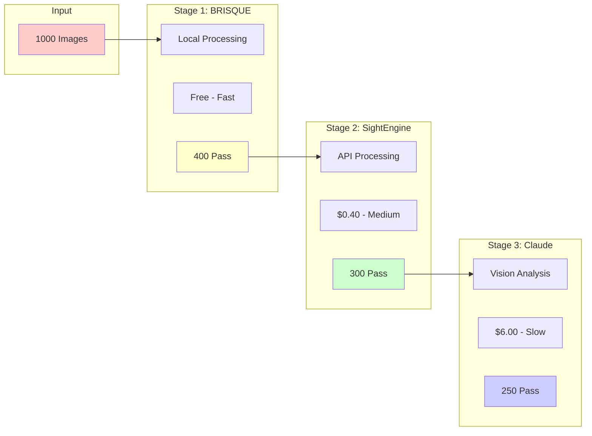
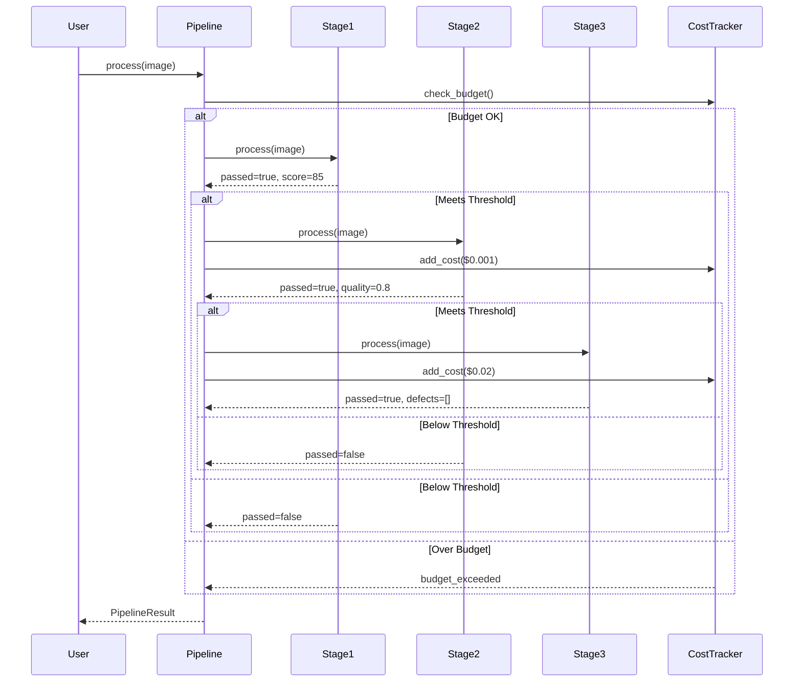

# Pipeline Architecture

## Overview

The AliceMultiverse pipeline system implements a sophisticated multi-stage quality assessment framework that balances cost, speed, and accuracy. This document details the pipeline architecture, stage design, and extension mechanisms.

## Pipeline Concept



## Design Principles

### 1. Progressive Filtering
Each stage filters out lower-quality content, reducing the volume for expensive operations:
- **Stage 1**: Eliminates 60% (technical quality)
- **Stage 2**: Eliminates 25% more (AI detection, advanced quality)
- **Stage 3**: Eliminates 15% more (semantic defects)

### 2. Cost Optimization
```
Traditional Approach: 1000 × $0.021 = $21.00
Pipeline Approach:    1000 × $0 + 400 × $0.001 + 300 × $0.02 = $6.40
Savings:             69.5%
```

### 3. Fail-Fast Philosophy
Cheaper, faster checks run first to quickly eliminate poor content.

## Pipeline Components

### Pipeline Manager

```python
class QualityPipeline:
    """Orchestrates multi-stage quality assessment."""
    
    def __init__(self, config: PipelineConfig):
        self.stages = self._build_stages(config)
        self.results = PipelineResults()
        
    def process(self, image_path: Path) -> PipelineResult:
        """Process image through configured stages."""
        result = PipelineResult(image_path)
        
        for stage in self.stages:
            # Check if should continue
            if not self._meets_threshold(result, stage):
                result.stopped_at = stage.name
                break
            
            # Process through stage
            try:
                stage_result = stage.process(image_path, result)
                result.add_stage_result(stage.name, stage_result)
                
                # Apply cost tracking
                self._track_cost(stage, stage_result)
                
            except StageError as e:
                result.add_error(stage.name, e)
                if stage.required:
                    break
                    
        return result
```

### Stage Interface

```python
class PipelineStage(ABC):
    """Abstract base class for pipeline stages."""
    
    def __init__(self, config: StageConfig):
        self.name = config.name
        self.config = config
        self.cost_per_call = config.cost_per_call
        self.threshold = config.threshold
        
    @abstractmethod
    def process(self, image_path: Path, context: PipelineResult) -> StageResult:
        """Process image and return results."""
        pass
        
    @abstractmethod
    def validate_input(self, image_path: Path) -> bool:
        """Check if input is valid for this stage."""
        pass
```

## Built-in Stages

### 1. BRISQUE Stage

```python
class BRISQUEStage(PipelineStage):
    """No-reference image quality assessment."""
    
    def __init__(self, config: StageConfig):
        super().__init__(config)
        self.scorer = BRISQUEScorer()
        
    def process(self, image_path: Path, context: PipelineResult) -> StageResult:
        # Load and prepare image
        image = Image.open(image_path)
        if image.mode != 'RGB':
            image = image.convert('RGB')
        
        # Calculate BRISQUE score
        score = self.scorer.calculate(image)
        stars = self._score_to_stars(score)
        
        return StageResult(
            stage_name=self.name,
            passed=stars >= self.threshold,
            data={
                'score': score,
                'stars': stars,
                'processing_time': time.time() - start
            }
        )
```

**Stage Characteristics:**
- **Cost**: Free (local processing)
- **Speed**: ~0.1s per image
- **Accuracy**: Good for technical quality
- **Threshold**: Typically 4+ stars

### 2. SightEngine Stage

```python
class SightEngineStage(PipelineStage):
    """Advanced quality and AI detection via API."""
    
    def __init__(self, config: StageConfig, api_key: str):
        super().__init__(config)
        self.client = SightEngineClient(api_key)
        
    def process(self, image_path: Path, context: PipelineResult) -> StageResult:
        # Upload and analyze
        response = self.client.check(
            image_path,
            models=['quality', 'type', 'properties']
        )
        
        # Extract results
        quality_score = response['quality']['score']
        is_ai_generated = response['type']['ai_generated'] > 0.7
        
        return StageResult(
            stage_name=self.name,
            passed=quality_score >= self.threshold and is_ai_generated,
            data={
                'quality_score': quality_score,
                'ai_probability': response['type']['ai_generated'],
                'properties': response['properties'],
                'api_cost': self.cost_per_call
            }
        )
```

**Stage Characteristics:**
- **Cost**: $0.001 per image
- **Speed**: ~0.5s per image (network dependent)
- **Accuracy**: Excellent for AI detection
- **Threshold**: 0.7+ quality score

### 3. Claude Vision Stage

```python
class ClaudeVisionStage(PipelineStage):
    """Semantic defect detection using Claude."""
    
    DEFECT_PROMPT = """
    Analyze this AI-generated image for defects:
    1. Anatomical errors (extra fingers, distorted faces)
    2. Logical inconsistencies (floating objects, impossible physics)
    3. Rendering artifacts (blur, noise, incomplete areas)
    4. Compositional issues (bad cropping, unclear subject)
    
    Respond with JSON: {"has_defects": bool, "defects": [...], "severity": 1-5}
    """
    
    def process(self, image_path: Path, context: PipelineResult) -> StageResult:
        # Encode image
        with open(image_path, 'rb') as f:
            image_data = base64.b64encode(f.read()).decode()
        
        # Query Claude
        response = self.client.messages.create(
            model="claude-3-opus-20240229",
            messages=[{
                "role": "user",
                "content": [
                    {"type": "image", "source": {"type": "base64", "data": image_data}},
                    {"type": "text", "text": self.DEFECT_PROMPT}
                ]
            }]
        )
        
        # Parse response
        result = json.loads(response.content[0].text)
        
        return StageResult(
            stage_name=self.name,
            passed=not result['has_defects'] or result['severity'] < 3,
            data={
                'defects': result['defects'],
                'severity': result['severity'],
                'api_cost': self._calculate_cost(response)
            }
        )
```

**Stage Characteristics:**
- **Cost**: ~$0.02 per image
- **Speed**: ~2s per image
- **Accuracy**: Excellent for semantic issues
- **Threshold**: Severity < 3

## Pipeline Configuration

### Configuration Schema

```yaml
pipeline:
  configurations:
    basic:
      stages: ["brisque"]
      description: "Local quality assessment only"
      
    standard:
      stages: ["brisque", "sightengine"]
      description: "Quality + AI detection"
      
    premium:
      stages: ["brisque", "sightengine", "claude"]
      description: "Full quality pipeline"
      
    custom:
      stages: []  # User-defined
      
  stages:
    brisque:
      class: "BRISQUEStage"
      threshold: 4  # Minimum stars to pass
      required: true
      config:
        score_ranges:
          5: [0, 20]
          4: [20, 40]
          3: [40, 60]
          2: [60, 80]
          1: [80, 100]
          
    sightengine:
      class: "SightEngineStage"
      threshold: 0.7
      required: false
      config:
        models: ["quality", "type", "properties"]
        timeout: 30
        
    claude:
      class: "ClaudeVisionStage"
      threshold: 3  # Maximum severity to pass
      required: false
      config:
        model: "claude-3-opus-20240229"
        max_tokens: 500
        temperature: 0
        
  thresholds:
    min_stars_for_sightengine: 4
    min_quality_for_claude: 0.7
    
  cost_limits:
    per_image: 0.10
    per_batch: 50.00
    total: 100.00
```

### Dynamic Configuration

```python
# Runtime pipeline configuration
pipeline = QualityPipeline.from_config(
    config_path="pipeline.yaml",
    overrides={
        "stages.brisque.threshold": 3,  # More permissive
        "cost_limits.per_batch": 20.00   # Lower budget
    }
)
```

## Pipeline Execution Flow



## Cost Management

### Cost Tracking

```python
class CostTracker:
    """Tracks and enforces cost limits."""
    
    def __init__(self, limits: CostLimits):
        self.limits = limits
        self.current_costs = {
            'session': 0.0,
            'batch': 0.0,
            'total': self._load_total_cost()
        }
        
    def can_proceed(self, stage_cost: float) -> bool:
        """Check if we can afford the next stage."""
        return all([
            self.current_costs['session'] + stage_cost <= self.limits.per_image,
            self.current_costs['batch'] + stage_cost <= self.limits.per_batch,
            self.current_costs['total'] + stage_cost <= self.limits.total
        ])
        
    def add_cost(self, cost: float, stage: str):
        """Record cost for a stage."""
        self.current_costs['session'] += cost
        self.current_costs['batch'] += cost
        self.current_costs['total'] += cost
        
        # Log for auditing
        logger.info(f"Pipeline cost: {stage} = ${cost:.4f}")
```

### Cost Optimization Strategies

1. **Batch Processing**
   ```python
   # Group images for API calls
   batch = []
   for image in images:
       batch.append(image)
       if len(batch) >= 100:
           results = sightengine.check_batch(batch)
           batch.clear()
   ```

2. **Caching API Results**
   ```python
   # Cache expensive API calls
   cache_key = f"claude_{image_hash}"
   if cached_result := cache.get(cache_key):
       return cached_result
   ```

3. **Sampling Strategy**
   ```python
   # Only process subset for large batches
   if len(images) > 1000:
       sample_size = int(len(images) * 0.1)
       sample = random.sample(images, sample_size)
       # Process sample first, extrapolate
   ```

## Custom Stage Development

### Example: Watermark Detection Stage

```python
class WatermarkDetectionStage(PipelineStage):
    """Detect and filter watermarked images."""
    
    def __init__(self, config: StageConfig):
        super().__init__(config)
        self.detector = WatermarkDetector()
        
    def process(self, image_path: Path, context: PipelineResult) -> StageResult:
        image = cv2.imread(str(image_path))
        
        # Detect watermarks
        has_watermark, confidence, location = self.detector.detect(image)
        
        return StageResult(
            stage_name="watermark_detection",
            passed=not has_watermark or confidence < 0.5,
            data={
                'has_watermark': has_watermark,
                'confidence': confidence,
                'location': location
            }
        )
        
    def validate_input(self, image_path: Path) -> bool:
        return image_path.suffix.lower() in ['.jpg', '.png', '.webp']
```

### Registering Custom Stages

```python
# Register custom stage
PipelineRegistry.register('watermark', WatermarkDetectionStage)

# Use in configuration
pipeline_config = {
    "stages": ["brisque", "watermark", "sightengine"],
    "watermark": {
        "threshold": 0.5,
        "required": false
    }
}
```

## Error Handling

### Stage Failure Handling

```python
class PipelineErrorHandler:
    """Handles errors in pipeline execution."""
    
    def handle_stage_error(self, stage: str, error: Exception) -> ErrorAction:
        if isinstance(error, APIRateLimitError):
            return ErrorAction.RETRY_LATER
            
        elif isinstance(error, APIKeyError):
            return ErrorAction.SKIP_STAGE
            
        elif isinstance(error, NetworkError):
            return ErrorAction.RETRY_NOW
            
        else:
            logger.error(f"Stage {stage} failed: {error}")
            return ErrorAction.CONTINUE
```

## Performance Optimization

### 1. Parallel Stage Execution
```python
async def process_parallel(self, image: Path) -> PipelineResult:
    """Run independent stages in parallel."""
    # Stages that can run in parallel
    parallel_stages = [s for s in self.stages if s.parallel_safe]
    
    tasks = []
    for stage in parallel_stages:
        task = asyncio.create_task(stage.process_async(image))
        tasks.append(task)
    
    results = await asyncio.gather(*tasks)
    return self._merge_results(results)
```

### 2. Result Caching
```python
# Cache stage results independently
def get_stage_result(self, image_hash: str, stage: str) -> Optional[StageResult]:
    cache_key = f"{stage}:{image_hash}"
    return self.cache.get(cache_key)
```

## Monitoring and Analytics

### Pipeline Metrics

```python
class PipelineMetrics:
    """Track pipeline performance metrics."""
    
    def __init__(self):
        self.stage_stats = defaultdict(StageStatistics)
        
    def record_stage_execution(self, stage: str, result: StageResult):
        stats = self.stage_stats[stage]
        stats.total_processed += 1
        stats.total_passed += 1 if result.passed else 0
        stats.total_time += result.processing_time
        stats.total_cost += result.cost
        
    def get_summary(self) -> dict:
        return {
            stage: {
                'processed': stats.total_processed,
                'pass_rate': stats.total_passed / stats.total_processed,
                'avg_time': stats.total_time / stats.total_processed,
                'total_cost': stats.total_cost
            }
            for stage, stats in self.stage_stats.items()
        }
```

## Future Enhancements

1. **ML-Based Stage Ordering** - Dynamically reorder stages based on historical pass rates
2. **Adaptive Thresholds** - Adjust thresholds based on collection characteristics
3. **Stage Composition** - Combine multiple checks into single API call
4. **Streaming Pipeline** - Process images as they arrive
5. **GPU Acceleration** - For local quality assessment stages