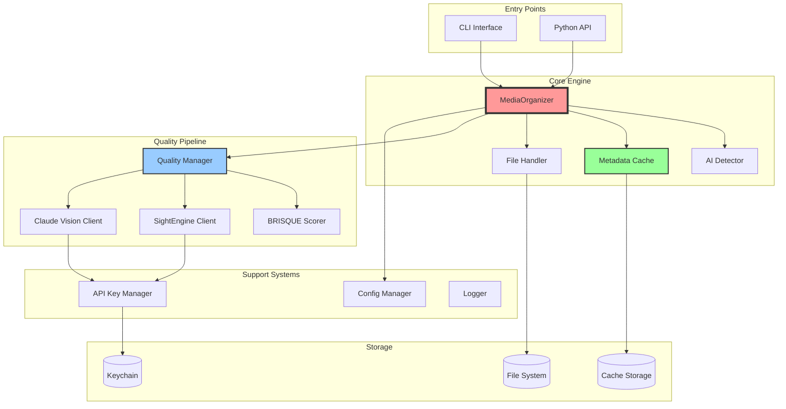
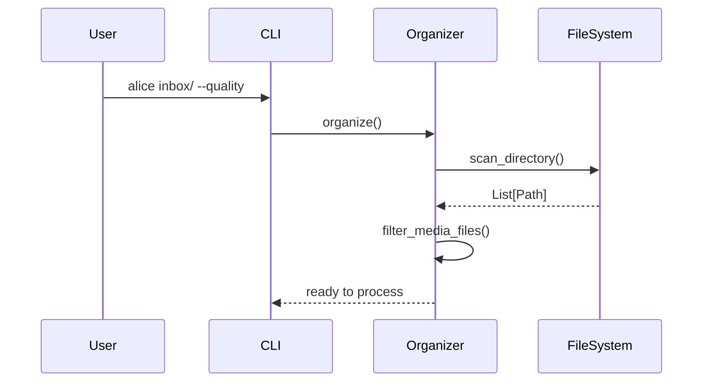
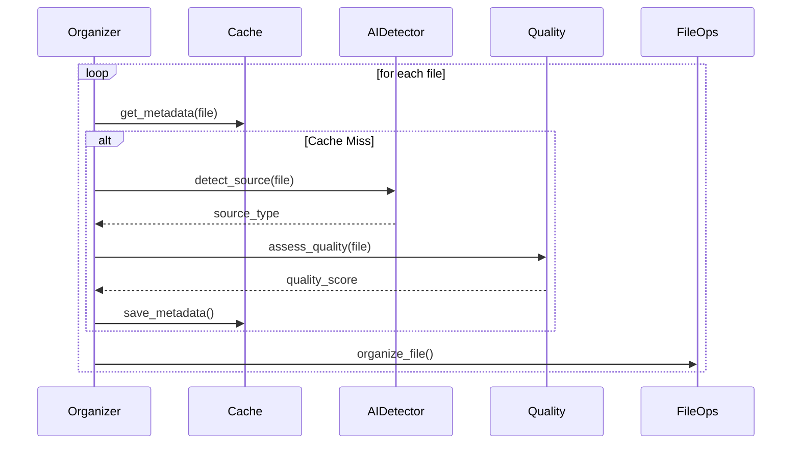
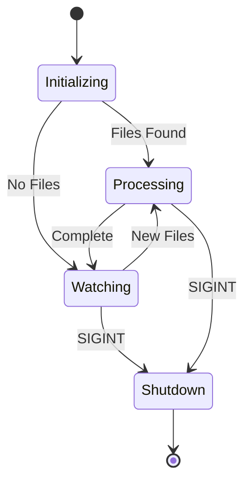
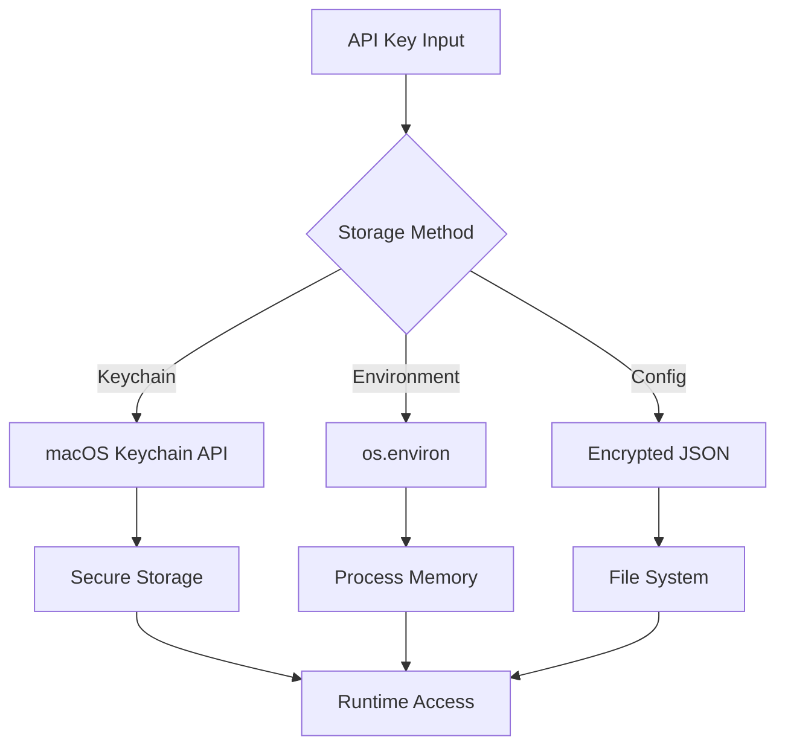

# System Design

## Overview

AliceMultiverse is designed as a pipeline-based media organization system with pluggable components for quality assessment and AI detection. This document details the technical design and implementation.

## System Components



## Core Classes and Interfaces

### MediaOrganizer

The central orchestrator that coordinates all processing activities.

```python
class MediaOrganizer:
    """Main class for organizing AI-generated media files."""
    
    def __init__(self, config: DictConfig):
        self.config = config
        self.file_handler = FileHandler(dry_run=config.processing.dry_run)
        self.metadata_cache = MetadataCache(source_dir, force_reindex)
        self.quality_assessor = BRISQUEAssessor() if quality_enabled else None
        
    def organize(self) -> bool:
        """Main entry point for organization."""
        if self.watch_mode:
            return self._watch_and_organize()
        else:
            return self._organize_once()
    
    def _process_file(self, file_path: Path) -> OrganizeResult:
        """Process a single media file through the pipeline."""
        # 1. Check cache
        # 2. Analyze if needed
        # 3. Build destination
        # 4. Copy/move file
        # 5. Update statistics
```

### Quality Assessment Pipeline

```python
class QualityPipeline:
    """Manages multi-stage quality assessment."""
    
    def __init__(self, stages: List[str], config: DictConfig):
        self.stages = self._initialize_stages(stages)
        self.config = config
        
    def assess(self, image_path: Path) -> PipelineResult:
        """Run image through configured pipeline stages."""
        result = PipelineResult()
        
        for stage in self.stages:
            if not self._should_continue(result, stage):
                break
                
            stage_result = stage.process(image_path)
            result.add_stage_result(stage.name, stage_result)
            
        return result
```

### Metadata Cache

```python
class MetadataCache:
    """Content-addressable cache for file metadata."""
    
    def __init__(self, source_root: Path, force_reindex: bool = False):
        self.source_root = source_root
        self.cache_dir = source_root / ".alicemultiverse_cache"
        self.force_reindex = force_reindex
        
    def get_metadata(self, file_path: Path) -> Optional[Dict[str, Any]]:
        """Retrieve cached metadata for a file."""
        content_hash = self._get_content_hash(file_path)
        cache_path = self._get_cache_path(content_hash)
        
        if cache_path.exists() and not self._is_stale(file_path, cache_path):
            return self._load_cache_file(cache_path)
        return None
```

## Data Flow Architecture

### 1. File Discovery Phase



### 2. Processing Phase



### 3. Watch Mode Operation



## File Organization Algorithm

### Path Construction

```python
def build_destination_path(self, file_info: Dict) -> Path:
    """Build the destination path for a media file."""
    # Pattern: organized/YYYY-MM-DD/project/source/[quality]/filename
    
    components = [
        self.output_dir,
        file_info['date_taken'],      # 2024-03-15
        file_info['project_folder'],   # my-project
        file_info['source_type'],      # midjourney
    ]
    
    if file_info.get('quality_stars'):
        components.append(f"{file_info['quality_stars']}-star")
    
    base_path = Path(*components)
    return base_path / self._generate_filename(file_info)
```

### Filename Generation

```python
def _generate_filename(self, file_info: Dict) -> str:
    """Generate sequential filename avoiding conflicts."""
    base_name = f"{file_info['project_folder']}-{self.sequence_number:05d}"
    extension = file_info['original_path'].suffix
    
    # Check for conflicts and increment if needed
    while (self.base_path / f"{base_name}{extension}").exists():
        self.sequence_number += 1
        base_name = f"{file_info['project_folder']}-{self.sequence_number:05d}"
    
    return f"{base_name}{extension}"
```

## Caching Strategy

### Cache Structure

```
.alicemultiverse_cache/
├── version.json           # Cache version for migrations
├── stats.json            # Cache performance statistics
├── ab/                   # Sharded by first 2 chars of hash
│   ├── abcd1234...json   # Individual cache entries
│   └── abef5678...json
└── cd/
    └── cdef9012...json
```

### Cache Entry Format

```json
{
    "version": "3.0.0",
    "file_hash": "abcd1234...",
    "file_path": "relative/path/to/file.jpg",
    "file_size": 1024000,
    "timestamp": "2024-03-15T10:30:00",
    "analysis": {
        "media_type": "image",
        "date_taken": "2024-03-15",
        "source_type": "midjourney",
        "quality_score": 25.5,
        "quality_stars": 4,
        "metadata": {
            "prompt": "a beautiful landscape",
            "model": "v5"
        }
    },
    "analysis_time": 0.125
}
```

## Error Handling

### Error Categories

1. **Recoverable Errors** - Continue processing
   - Corrupted individual files
   - Missing metadata
   - API timeouts

2. **Fatal Errors** - Stop processing
   - No disk space
   - Invalid configuration
   - Missing required dependencies

### Error Recovery Strategy

```python
class ErrorHandler:
    def __init__(self, max_retries: int = 3):
        self.max_retries = max_retries
        self.errors = []
        
    def handle_file_error(self, file_path: Path, error: Exception):
        """Handle errors for individual files."""
        self.errors.append({
            'file': file_path,
            'error': str(error),
            'timestamp': datetime.now()
        })
        
        if self._is_recoverable(error):
            return self._retry_operation()
        else:
            logger.error(f"Unrecoverable error for {file_path}: {error}")
            return None
```

## Performance Optimizations

### 1. Lazy Loading
- Load image data only when needed for quality assessment
- Stream large files rather than loading entirely

### 2. Batch Operations
- Group cache writes to reduce I/O
- Batch API calls when possible

### 3. Progress Tracking
```python
with tqdm(total=len(files), desc="Organizing") as pbar:
    for file in files:
        result = self._process_file(file)
        pbar.update(1)
        pbar.set_postfix({
            'success': stats['success'],
            'errors': stats['errors']
        })
```

## Concurrency Model

Currently single-threaded with provisions for future parallelization:

```python
# Future enhancement
from concurrent.futures import ThreadPoolExecutor

def parallel_organize(self, files: List[Path]):
    with ThreadPoolExecutor(max_workers=4) as executor:
        futures = []
        for file in files:
            future = executor.submit(self._process_file, file)
            futures.append(future)
        
        for future in concurrent.futures.as_completed(futures):
            result = future.result()
            self._update_statistics(result)
```

## Security Considerations

### API Key Storage



### File System Security
- Validate all paths to prevent directory traversal
- Check permissions before operations
- Sanitize filenames for compatibility

## Monitoring and Observability

### Metrics Collected
- Files processed per second
- Cache hit rate
- API call success rate
- Error rate by type
- Quality score distribution

### Logging Levels
```python
logger.debug("Detailed operation info")
logger.info("Normal operation status")
logger.warning("Degraded but continuing")
logger.error("Operation failed")
logger.critical("System failure")
```

## Future Architecture Considerations

### 1. Plugin System
```python
class Plugin(ABC):
    @abstractmethod
    def process(self, file_path: Path) -> Dict:
        pass
        
class PluginManager:
    def register(self, plugin: Plugin):
        self.plugins.append(plugin)
```

### 2. Distributed Processing
- Message queue for work distribution
- Shared cache via Redis
- Worker pool for parallel processing

### 3. Web API
```python
# FastAPI endpoint example
@app.post("/organize")
async def organize_files(
    source: str,
    destination: str,
    options: OrganizeOptions
):
    return await organizer.organize_async(
        source, destination, options
    )
```