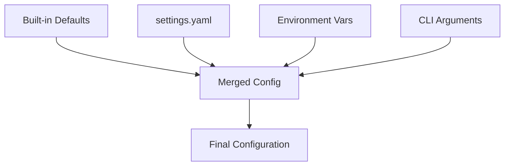

# Configuration Guide

AliceMultiverse uses a flexible configuration system that supports YAML files, environment variables, and command-line overrides. This guide covers all configuration options and best practices.

## Configuration Hierarchy

Configuration sources are merged in this order (later overrides earlier):

1. **Built-in defaults** - Sensible defaults for all settings
2. **Configuration file** - `settings.yaml` or custom file
3. **Environment variables** - For deployment/CI
4. **Command-line arguments** - For one-off changes



## Configuration File

### Default Location

AliceMultiverse looks for configuration in these locations (in order):

1. `./settings.yaml` (current directory)
2. `~/.alicemultiverse/settings.yaml` (user home)
3. `/etc/alicemultiverse/settings.yaml` (system-wide)

### Complete Configuration Reference

```yaml
# AliceMultiverse Configuration
# Version: 1.0.1

# Path configuration
paths:
  # Source directory containing AI-generated media
  inbox: "inbox"  # Can be absolute: /Users/you/Pictures/AI/inbox
  
  # Output directory for organized files
  organized: "organized"  # Can be absolute: /Users/you/Pictures/AI/organized
  
  # Metadata storage location (relative to inbox)
  metadata_dir: ".metadata"

# Processing options
processing:
  # Copy files instead of moving them
  copy_mode: true
  
  # Enable quality assessment
  quality: false
  
  # Watch mode - monitor for new files
  watch: false
  
  # Check interval in seconds (watch mode)
  watch_interval: 5
  
  # Force re-analysis (ignore cache)
  force_reindex: false
  
  # Preview mode - no file operations
  dry_run: false
  
  # Number of workers for parallel processing (future)
  workers: 1

# Quality assessment configuration
quality:
  # BRISQUE score thresholds for star ratings
  thresholds:
    5_star:
      min: 0
      max: 25
    4_star:
      min: 25
      max: 45
    3_star:
      min: 45
      max: 65
    2_star:
      min: 65
      max: 80
    1_star:
      min: 80
      max: 100
  
  # Maximum image dimension (resize if larger)
  max_dimension: 2048
  
  # Skip quality for these extensions
  skip_extensions: [".gif", ".webp"]

# AI generator detection patterns
ai_generators:
  image:
    - "stablediffusion"
    - "stable-diffusion"
    - "sd"
    - "sdxl"
    - "midjourney"
    - "mj"
    - "dalle"
    - "dall-e"
    - "openai"
    - "comfyui"
    - "automatic1111"
    - "flux"
    - "leonardo"
    - "playground"
    - "ideogram"
    - "firefly"
    
  video:
    - "runway"
    - "gen-2"
    - "gen2"
    - "pika"
    - "stable-video"
    - "animatediff"
    - "deforum"
    - "cogvideo"
    - "modelscope"
    - "zeroscope"
    - "videocrafter"
    - "lavie"
    - "imagen-video"
    - "make-a-video"
    - "phenaki"

# File type configuration
file_types:
  # Supported image extensions (AI-generated content focus)
  image_extensions:
    - ".jpg"
    - ".jpeg"
    - ".png"
    
  # Supported video extensions
  video_extensions:
    - ".mp4"
    - ".mov"

# Multi-stage pipeline configuration
pipeline:
  # Pipeline presets
  configurations:
    basic:
      stages: ["brisque"]
      description: "Local quality assessment only"
      
    standard:
      stages: ["brisque", "sightengine"]
      description: "Quality + AI detection"
      
    premium:
      stages: ["brisque", "sightengine", "claude"]
      description: "Full quality + defect detection"
      
    custom:
      stages: []  # User-defined
  
  # Stage-specific settings
  stages:
    brisque:
      enabled: true
      threshold: 4  # Minimum stars to pass to next stage
      
    sightengine:
      enabled: false
      threshold: 0.7  # Minimum quality score
      models: ["quality", "type", "properties"]
      timeout: 30
      
    claude:
      enabled: false
      threshold: 3  # Maximum defect severity
      model: "claude-3-opus-20240229"
      max_tokens: 500
      temperature: 0
  
  # Cost management
  cost_limits:
    per_image: 0.10      # Maximum per image
    per_batch: 50.00     # Maximum per run
    total: 100.00        # Maximum total
    
  # Performance settings
  batch_size: 100        # API batch size
  retry_attempts: 3      # API retry count
  retry_delay: 1.0       # Seconds between retries

# Organization settings
organization:
  # Date format for output folders
  date_format: "%Y-%m-%d"  # 2024-03-15
  
  # Filename template
  filename_template: "{project}-{number:05d}"  # project-00001
  
  # Starting number for sequences
  sequence_start: 1
  
  # Preserve original filename in metadata
  preserve_filename: true
  
  # Create project folder even with single file
  always_use_project_folder: true
  
  # Fallback project name
  default_project: "uncategorized"

# Metadata and caching
metadata:
  # Cache version (for migrations)
  cache_version: "3.0.0"
  
  # Cache folder name
  folder_name: ".alicemultiverse_cache"
  
  # Enable cache expiration
  enable_expiration: false
  
  # Cache expiration days
  expiration_days: 30
  
  # Validate cache on load
  validate_on_load: true

# Logging configuration
logging:
  # Log level: DEBUG, INFO, WARNING, ERROR, CRITICAL
  level: "INFO"
  
  # Log file path (null for no file logging)
  file: null  # or "alicemultiverse.log"
  
  # Log format
  format: "%(asctime)s - %(name)s - %(levelname)s - %(message)s"
  
  # Console output
  console: true
  
  # Colorized output
  colorize: true

# API configuration
api:
  # API timeout in seconds
  timeout: 30
  
  # Retry configuration
  retry:
    max_attempts: 3
    backoff_factor: 2.0
    
  # Proxy settings (if needed)
  proxy: null  # or "http://proxy.example.com:8080"
  
  # SSL verification
  verify_ssl: true

# Advanced settings
advanced:
  # Enable experimental features
  experimental: false
  
  # Parallel processing
  parallel:
    enabled: false
    max_workers: 4
    
  # Memory limits
  memory:
    max_image_size_mb: 100
    cache_size_mb: 500
    
  # Performance tuning
  performance:
    chunk_size: 8192          # File I/O chunk size
    hash_algorithm: "sha256"  # Content hashing
    compression: null         # Future: cache compression
```

## Environment Variables

All configuration options can be set via environment variables using this pattern:
`ALICEMULTIVERSE_<SECTION>_<KEY>`

### Examples

```bash
# Path settings
export ALICEMULTIVERSE_PATHS_INBOX="/home/user/ai-media"
export ALICEMULTIVERSE_PATHS_ORGANIZED="/home/user/organized"

# Processing options
export ALICEMULTIVERSE_PROCESSING_QUALITY=true
export ALICEMULTIVERSE_PROCESSING_WATCH=true

# Quality thresholds
export ALICEMULTIVERSE_QUALITY_THRESHOLDS_5_STAR_MAX=30

# Pipeline settings
export ALICEMULTIVERSE_PIPELINE_COST_LIMITS_PER_BATCH=25.0

# API keys (special handling)
export ANTHROPIC_API_KEY="sk-ant-..."
export SIGHTENGINE_API_USER="your-user"
export SIGHTENGINE_API_SECRET="your-secret"
```

## Command-Line Overrides

Override any configuration option from the command line:

```bash
# Override paths
alice organize ~/Pictures --output ~/Organized

# Override processing options
alice organize inbox --quality --watch

# Override with OmegaConf syntax
alice organize inbox \
  processing.quality=true \
  quality.thresholds.5_star.max=30 \
  pipeline.cost_limits.per_batch=10.0
```

## Configuration Profiles

Create multiple configuration files for different use cases:

### High-Quality Profile

`settings-hq.yaml`:
```yaml
processing:
  quality: true

quality:
  thresholds:
    5_star: {min: 0, max: 20}    # Stricter
    4_star: {min: 20, max: 35}
    3_star: {min: 35, max: 50}
    2_star: {min: 50, max: 70}
    1_star: {min: 70, max: 100}

pipeline:
  configurations:
    default: "premium"
```

### Fast Profile

`settings-fast.yaml`:
```yaml
processing:
  quality: false
  workers: 4

advanced:
  parallel:
    enabled: true
    max_workers: 8
```

### Usage

```bash
# Use specific profile
alice organize inbox --config settings-hq.yaml

# Or via environment
export ALICEMULTIVERSE_CONFIG=settings-fast.yaml
alice organize inbox
```

## Best Practices

### 1. Version Control

Keep your configuration in version control:

```bash
# .gitignore
settings.yaml       # Local overrides
settings-prod.yaml  # Production settings with secrets

# Track these
settings.example.yaml
settings-dev.yaml
```

### 2. Security

Never commit sensitive data:

```yaml
# BAD - Don't do this
api:
  keys:
    anthropic: "sk-ant-actual-key-here"

# GOOD - Use environment variables
api:
  keys:
    anthropic: ${ANTHROPIC_API_KEY}
```

### 3. Validation

Validate configuration before use:

```python
from alicemultiverse.core.config import load_config, validate_config

config = load_config("settings.yaml")
errors = validate_config(config)
if errors:
    print("Configuration errors:", errors)
```

### 4. Incremental Changes

Start with defaults and modify incrementally:

```yaml
# Start simple
paths:
  inbox: "~/Pictures/AI/inbox"

# Add features as needed
processing:
  quality: true
  
# Tune based on results
quality:
  thresholds:
    4_star: {min: 20, max: 40}  # Adjusted
```

## Configuration for Different Environments

### Development

```yaml
logging:
  level: "DEBUG"
  file: "dev.log"

processing:
  dry_run: true  # Safety first

advanced:
  experimental: true
```

### Production

```yaml
logging:
  level: "WARNING"
  file: "/var/log/alicemultiverse/app.log"

processing:
  workers: 8

api:
  retry:
    max_attempts: 5
```

### CI/CD

```yaml
processing:
  dry_run: true
  force_reindex: true

pipeline:
  cost_limits:
    per_batch: 1.00  # Minimal cost for tests
```

## Troubleshooting Configuration

### Debug Configuration Loading

```bash
# Show final configuration
alice organize inbox --show-config

# Debug configuration sources
ALICEMULTIVERSE_DEBUG_CONFIG=true alice organize inbox
```

### Common Issues

**"Configuration key not found"**
- Check spelling and nesting
- Use dots for nested keys: `quality.thresholds.5_star.max`

**"Invalid configuration"**
- Validate YAML syntax: `yamllint settings.yaml`
- Check data types match schema

**"Settings not taking effect"**
- Check override precedence
- Ensure file is in search path
- Verify no typos in environment variables

## Next Steps

- 🚀 [Run your first organization](quickstart.md)
- 🔑 [Configure API keys](../user-guide/api-keys.md)
- 📊 [Set up quality pipeline](../user-guide/pipeline-system.md)
- 🏗️ [Understand the architecture](../architecture/index.md)