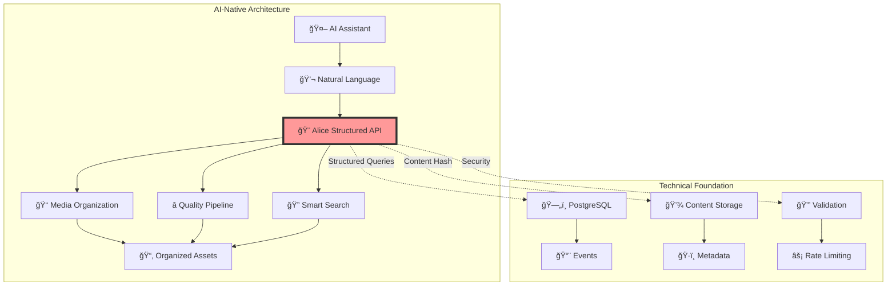

# AliceMultiverse Documentation

<h2>Creative Workflow Hub for AI-Assisted Production</h2>

Evolving from media organization to comprehensive creative orchestration

## What is AliceMultiverse?

AliceMultiverse is transforming from a media organization tool into a comprehensive creative workflow hub. It bridges AI assistants (Claude, ChatGPT) with creative tools and APIs, designed for professionals who work iteratively with AI over extended periods.

### Current Capabilities (AI-Native Service)
- 🤖 **Natural Conversations** - Use Alice through Claude or ChatGPT
- 📁 **Smart Organization** - AI-powered media management
- ⭐ **Quality Assessment** - Multi-stage filtering (BRISQUE, SightEngine, Claude)
- 🔍 **Semantic Search** - Find assets using natural descriptions
- 🎨 **Project Context** - AI remembers your creative work

### Technical Foundation
- 💾 **Content-Addressed Storage** - Efficient metadata management
- 🔄 **Event System** - PostgreSQL-based event streaming
- 🚀 **Provider Integration** - Extensible AI tool connections
- 📊 **Structured APIs** - No fuzzy NLP in core system
- 🔒 **Security First** - Input validation and rate limiting

## Quick Links

- :material-robot: **[AI-Native Quick Start](getting-started/quickstart-ai.md)**
    
    Start using Alice through Claude or ChatGPT

- :material-book-open-variant: **[User Guide](user-guide/index.md)**
    
    Learn Alice through AI conversations

- :material-architecture: **[Architecture](architecture/index.md)**
    
    Simplified, pragmatic design

- :material-calendar-clock: **[Event System](architecture/event-driven-architecture.md)**
    
    PostgreSQL-native event streaming

## System Evolution

## For Creative Professionals

AliceMultiverse understands that creativity doesn't follow linear paths:

> "Remember that cool cyberpunk thing we were working on last month with the neon colors?"

The system is designed to:
- **Preserve Context** - Maintain creative decisions across months
- **Support Chaos** - Work with your creative process, not against it
- **Enable Continuity** - Resume projects seamlessly after breaks
- **Hide Complexity** - Technical details managed behind the scenes

## Documentation Structure

### Getting Started
- **[AI-Native Quick Start](getting-started/quickstart-ai.md)** - Start with Claude/ChatGPT
- **[Installation](getting-started/installation.md)** - Setup guide
- **[Configuration](getting-started/configuration.md)** - Customization

### Using Alice
- **[AI Conversations](user-guide/ai-conversations.md)** - Natural language examples
- **[Quality Pipeline](user-guide/pipeline-examples.md)** - Assessment stages
- **[API Keys](user-guide/api-keys.md)** - Service configuration

### Architecture
- **[System Design](architecture/index.md)** - Simplified architecture
- **[Event System](architecture/event-driven-architecture.md)** - PostgreSQL events
- **[AI-Native Design](architecture/ai-native-vision.md)** - Design principles
- **[ADR-006](architecture/adr/ADR-006-simplification-over-abstraction.md)** - How we reduced complexity

### Development
- **[Developer Guide](developer/development.md)** - Contributing
- **[Structured API](developer/search-api-specification.md)** - API design
- **[Security](architecture/adr/ADR-005-code-quality-security-tooling.md)** - Validation & rate limiting

## Why AliceMultiverse?

### Today's Benefits
1. **Automatic Organization** - AI-generated content sorted intelligently
2. **Quality First** - Best content surfaces naturally
3. **Cost Effective** - Progressive filtering reduces API costs 70-90%
4. **Performance** - Content-addressed caching prevents redundant work

### Tomorrow's Vision
1. **Creative Memory** - AI understands your project history
2. **Unified Interface** - One place for all AI tools
3. **Context Preservation** - Never lose creative momentum
4. **Scalable Architecture** - From personal to team use

## Next Steps

- 🤖 **New Users**: Start with the [AI-Native Quick Start](getting-started/quickstart-ai.md)
- 💬 **Learn by Example**: See [AI Conversation Patterns](user-guide/ai-conversations.md)
- 🔧 **Developers**: Read [ADR-006](architecture/adr/ADR-006-simplification-over-abstraction.md)
- 📊 **Advanced Users**: Configure [Quality Pipelines](user-guide/pipeline-examples.md)

---

**Note**: This documentation evolves with the project. As we build toward v2.x, new sections will cover Alice orchestration, provider integrations, and distributed deployment.