# AliceMultiverse Documentation

<h2>Creative Workflow Hub for AI-Assisted Production</h2>

Evolving from media organization to comprehensive creative orchestration

## What is AliceMultiverse?

AliceMultiverse is transforming from a media organization tool into a comprehensive creative workflow hub. It bridges AI assistants (Claude, ChatGPT) with creative tools and APIs, designed for professionals who work iteratively with AI over extended periods.

### Current Capabilities (v1.x)
- 🤖 **AI Source Detection** - Identifies 15+ AI generation tools
- ⭐ **Quality Assessment** - Multi-stage filtering (BRISQUE, SightEngine, Claude)
- 📁 **Smart Organization** - Content-addressed storage with metadata
- 🔄 **Watch Mode** - Continuous monitoring for new content
- 💾 **Unified Caching** - Intelligent metadata management

### Evolution to v2.x
- 🎨 **Alice Orchestration** - Intelligent endpoint for AI assistants
- 🚀 **Provider Integration** - Direct access to fal.ai, ComfyUI, and more
- 📊 **Project Management** - Creative context preservation
- 🎬 **Music Video Production** - Beat sync and timeline generation
- 🔌 **Event-Driven Architecture** - Microservices-ready foundation

## Quick Links

- :material-rocket-launch: **[Quick Start](getting-started/quickstart.md)**
    
    Get up and running in 5 minutes

- :material-book-open-variant: **[User Guide](user-guide/index.md)**
    
    Comprehensive usage documentation

- :material-architecture: **[Architecture](architecture/index.md)**
    
    Technical design and evolution

- :material-calendar-clock: **[Event System](architecture/event-driven-architecture.md)**
    
    Foundation for the future

## System Evolution

```mermaid
graph TB
    subgraph "Today - Media Organization"
        A[📁 Inbox] --> B[🔍 Organizer]
        B --> C[⭐ Quality]
        C --> D[📂 Output]
    end
    
    subgraph "Tomorrow - Creative Hub"
        E[🤖 AI Assistant] --> F[🎨 Alice]
        F --> G[🚀 Providers]
        F --> H[📊 Projects]
        G --> I[🎬 Assets]
    end
    
    B -.->|Events| F
    
    style F fill:#ff9999,stroke:#333,stroke-width:4px
```

## For Creative Professionals

AliceMultiverse understands that creativity doesn't follow linear paths:

> "Remember that cool cyberpunk thing we were working on last month with the neon colors?"

The system is designed to:
- **Preserve Context** - Maintain creative decisions across months
- **Support Chaos** - Work with your creative process, not against it
- **Enable Continuity** - Resume projects seamlessly after breaks
- **Hide Complexity** - Technical details managed behind the scenes

## Documentation Structure

### Getting Started
- **[Quick Start](getting-started/quickstart.md)** - 5-minute setup
- **[Installation](getting-started/installation.md)** - Detailed setup
- **[Configuration](getting-started/configuration.md)** - Customization

### Current Features
- **[Media Organization](user-guide/index.md)** - Core functionality
- **[Quality Pipeline](user-guide/pipeline-examples.md)** - Assessment stages
- **[API Keys](user-guide/api-keys.md)** - Service configuration

### Architecture & Future
- **[System Design](architecture/index.md)** - Current architecture
- **[Event System](architecture/event-driven-architecture.md)** - Evolution foundation
- **[Caching Strategy](architecture/caching-strategy.md)** - Performance optimization
- **[Vision Document](../todo/02%20alice-multiverse-big-refactor-into-a-bigger-scope.md)** - Complete roadmap

### Development
- **[Developer Guide](developer/development.md)** - Contributing
- **[Event Development](developer/event-system.md)** - Working with events
- **[API Reference](developer/api-reference.md)** - Module documentation

## Why AliceMultiverse?

### Today's Benefits
1. **Automatic Organization** - AI-generated content sorted intelligently
2. **Quality First** - Best content surfaces naturally
3. **Cost Effective** - Progressive filtering reduces API costs 70-90%
4. **Performance** - Content-addressed caching prevents redundant work

### Tomorrow's Vision
1. **Creative Memory** - AI understands your project history
2. **Unified Interface** - One place for all AI tools
3. **Context Preservation** - Never lose creative momentum
4. **Scalable Architecture** - From personal to team use

## Next Steps

- 🚀 **New Users**: Start with the [Quick Start Guide](getting-started/quickstart.md)
- 📸 **Current Users**: Explore [advanced features](user-guide/pipeline-examples.md)
- 🔧 **Developers**: Check the [event system](architecture/event-driven-architecture.md)
- 🔮 **Visionaries**: Read the [full vision](../todo/02%20alice-multiverse-big-refactor-into-a-bigger-scope.md)

---

**Note**: This documentation evolves with the project. As we build toward v2.x, new sections will cover Alice orchestration, provider integrations, and distributed deployment.